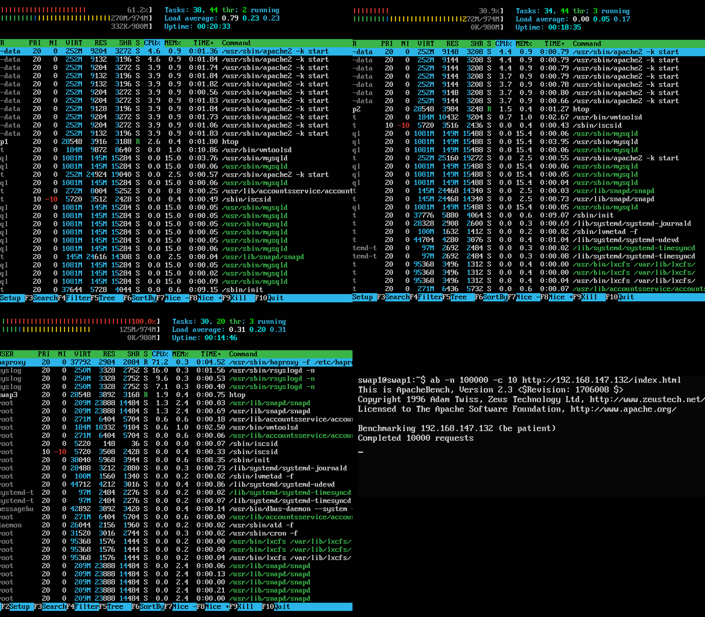

#Práctica 3: Balanceo de carga.


1. **Configuración de nginx en la nueva máquina que hará de balancecador**

Creamos una nueva máquina virtual para que ejerza como balanceador. Sí he instalado Apache, pero lo he desactivado para liberar el puerto 80 para que lo use el balanceador.

```bash
	sudo systemctl stop apache.service
```

Instalación de nginx:

```bash
	sudo apt-get install nginx
```

Lo lanzamos:

```bash
	sudo systemctl start nginx
```

En el archivo de configuración /etc/nginx/conf.d/default.conf añadiremos lo siguiente:

```script
upstream apaches {
  server 192.168.147.129 weight=2;
  server 192.168.147.131 weight=1;
}

server{
  listen 80;
  server_name balanceador;
  access_log /var/log/nginx/balanceador.access.log;
  error_log /var/log/nginx/balanceador.error.log;
  root /var/www/;
  location /
  {
    proxy_pass http://apaches;
    proxy_set_header Host $host;
    proxy_set_header X-Real-IP $remote_addr;
    proxy_set_header X-Forwarded-For $proxy_add_x_forwarded_for;
    proxy_http_version 1.1;
    proxy_set_header Connection "";
  }
}
```
Hemos atribuido unos pesos a cada una de las máquinas, 2 y 1, respectivamente, suponiendo que nuestra máquina 1 es superior a la 2. De esta forma, la m1 antenderá dos peticiones por cada una que atienda la m2.

Reiniciamos nginx para hacer efectivos los cambios:

```bash
	sudo systemctl restart nginx
```

Llegados este punto, necesitamos una cuarta máquina (podría ser el anfitrión) para hacer peticiones al balanceador. En mi caso he clonado la primera máquina. 

Desde la nueva máquina hacemos dos peticiones a la IP del balanceador:

```bash
	curl http://192.168.147.132/hola.html
```

Como resultado tenemos, alternativamente, respuestas de ambas máquinas finales:


2. **Configuración de haproxy en nuestra máquina balanceadora**

En mi caso no he creado una nueva máquina virtual, sino que usé diferentes capturas del estado de la máquina 3, una con la configuración de nginx y otra con haproxy. Cabe apuntar que aunque es un sistema rápido, puede no guardarse la configuración del todo bien, por lo que al restaurar alguna de las capturas de estado hay que comprobar que la configuración está como queremos y que el servicio está activo.

Instalamos haproxy:

```bash
	sudo apt-get install haproxy
```

Para la configuración, editamos el archivo /etc/haproxy/haproxy.cfg, donde añadimos al final del archivo lo siguiente:

```script
backends servers
  server m1 192.168.147.129 weight 100
  server m2 192.168.147.131 weight 50
```

Igual que con nginx, suponemos que nuestra máquina 1 es capaz de atender el doble de peticiones en el mismo intervalo de tiempo, por lo que hemos estipulado los pesos 100 a 50.

Lo lanzamos:

```bash
sudo /usr/sbin/haproxy -f /etc/haproxy/haproxy.cfg
```

Comprobamos que el balanceo es como hemos configurado:


3. **Sometemos a nuestra granja web a una alta carga, y comparamos el rendimiento de la misma usando nginx y haproxy.**

Vamos a someter a una carga a nuestro sistema de [balanceador + dos servidores finales] tanto con nginx como software de balanceo como con haproxy. Es importante, a la hora de comparar rendimiento, que ambos balanceadores estén configurados de igual forma, en mi caso, ambos están programados para que pasen dos peticiones a m1 antes de pasar una a m2.

Comando que ejecutamos en la máquina 4 para generar la carga:

```bash
	ab -n 10000 -c 10 http://192.168.147.132/index.html
```

En las m1 y m2 y en el balanceador ejecutamos lo siguiente para monitorizar la carga:

```bash
	htop
```

NGINX:


HAPROXY:



Como podemos observar en ambas capturas, la carga que sufre la máquina uno es entorno al doble de la carga que soporta la segunda máquina, tal y como cabía esperar dada la configuración. 

*Estadísticas del benchmark NGINX:


*Estadísticas del benchmark HAPROXY:


De estos datos podemos extraer la conclusión de que nginx ofrece un mejor rendimiento que haproxy, pues se atienden las mismas peticiones en menos tiempo, al menos para nuestro escenario y con la configuración 2 a 1 que hemos usado.

*He tomado una única captura por benchmark, pero ejecuté el benchmark repetidas veces para asegurarme de que los valores son cercanos a la realidad, cercanos a la media, y no están adulterados por posibles alteraciones puntuales.
