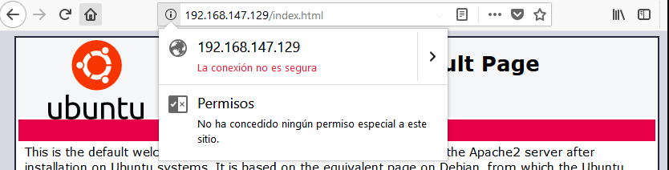

# Práctica 4: Asegurar nuestra granja web.


1. **Instalar un certificado SSL autofirmado para configurar el acceso por HTTPS**

Activamos el módulo SSL de Apache y generamos un certificado SSL autofirmado:

```bash
	a2enmod ssl
	
	service apache2 restart

	mkdir /etc/apache2/ssl

	openssl req -x509 -nodes -days 365 -newkey rsa:2048 -keyout /etc/apache2/ssl/apache.key -out /etc/apache2/ssl/apache.crt

```

Rellenamos la información que nos pide.


Editamos el siguiente archivo:

```bash
	sudo nano /etc/apache2/sites-available/default-ssl
```

Donde agregamos las siguientes líneas bajo la línea "SSLEngine on":

```script
	SSLCertificateFile /etc/apache2/ssl/apache.crt 
	SSLCertificateKeyFile /etc/apache2/ssl/apache.key
```

Activamos el sitio "default-ssl" y reiniciamos el servicio Apache:

```bash
	a2ensite default-ssl
	service apache2 reload
```

Esto lo hacemos en las dos máquinas servidoras.

Si accedemos a una de las máquinas desde un navegador web mediante el protocolo HTTPS veremos que se nos informa que la conexión no es segura.




Podemos hacer peticiones HTTPS desde la terminal con la siguiente instrucción:

```bash
	curl -k https://ipmaquina/index.html
```

Máquina 1:


Máquina 2:


Máquina balanceadora:


En la máquina balanceadora esta configuración difiere, ya que apache y nginx no puede confluir. Lo que hacemos es abrir el puerto 443 en los archivos de configuración de Nginx.


2. **Configuración del cortafuegos**

En la máquina 1 configuramos el cortafuegos. Para ello utilizamos la herramienta iptables, y haremos un spcript que se ejecutará al arrancar la máquina.

El script usado es el siguiente:

```script
#!/bin/sh

#Eliminamos cualquier regla previa 

iptables -F
iptables -X
iptables -Z
iptables -t nat -Z

#Hacemos que solo se pueda ingresar o salir del equipo con autorización explícita

iptables -P INPUT   DROP
iptables -P OUTPUT  DROP
iptables -P FORWARD DROP

#Al localhost se le permite todo

iptables -A INPUT  -i lo -j ACCEPT
iptables -A OUTPUT -o lo -j ACCEPT

#Establecemos el acceso a HTTP y HTTPS

iptables -A INPUT -i enp0s8 -p tcp -m multiport --dports 22,80,443 -m state --state NEW,ESTABLISHED -j ACCEPT
iptables -A OUTPUT -o enp0s8 -p tcp -m multiport --sports 22,80,443 -m state --state ESTABLISHED -j ACCEPT

```

Para que el script se ejecute en el arranque del sistema editamos el archivo /etc/rc.local, añadiendo una línea con la orden de ejecución del script antes de la última línea, que contiene la orden exit.


Este es el resultado del comando iptables -L -n -v:


Y este el resultado tras el reboot:


Al hacer netstat estos son los resultados obtenidos:


Los puertos están abiertos.
