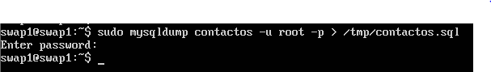
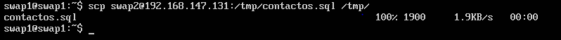
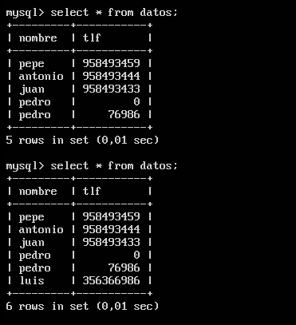
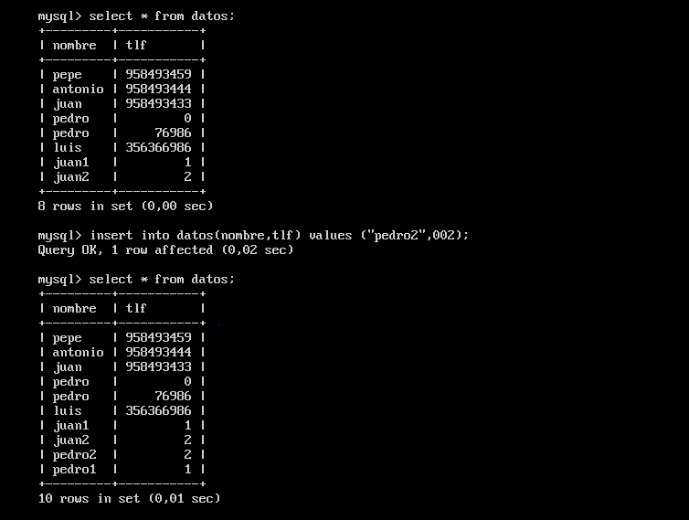

# Práctica 5: Replicación de bases de datos MySQL.


1. **Crear una BD e insertar datos**

El desarrollo de esta práctica se requiere tener una base de datos en MySQL.

Usamos el siguiente comando:

```bash
	mysql -uroot -p
```


Una vez dentro del monitor MySQL, creamos la base de datos:

```bash

	mysql> create database contactos;
```

Seleccionamos la BD e introducimos datos:


2. **Replicar una BD MysSQL con mysqldump**

mysqldump es una herramienta de MySQL para la clonación de BDs. 

En la máquina 1 ejecutamos lo siguiente, antes de la copia de seguridad, ya que durante este proceso podrían realizarse cambios, así que bloqueamos la lectura:

```bash

	mysql> FLUSH TABLES WITH READ LOCK;
```

En la máquina 1 ejecutamos el mysqldump:



Volvemos al monitor MySQL para desbloquear las tablas:

```bash

	mysql> UNLOCK TABLES;
```

En la máquina 2 ejecutamos el siguiente comando scp para copiar el archivo .SQL:




Ejecutamos la siguiente secuencia de contactos para importar la BD copiada:


3. **Replicación   de   BD   mediante   una   configuración maestro-esclavo**


Vamos al archivo de configuración /etc/mysql/mysql.conf.d/mysqld.cnf
y dejamos así las siguientes líneas:

```bash

	#bind-address 127.0.0.0
	log_error = /var/log/mysql/error.log
	server-id = 1
	log_bin = /var/log/mysql/mysql-bin.log
```

Esto lo hacemos en las dos máquinas, con la salvedad de que en la máquina 2 el ID del servidor es 2.

Reiniciamos el servicio para hacer efectivos los cambios:

```bash

	sudo /etc/init.d/mysql restart
```

En la máquina maestra creamos un usuario y le damos los permisos para la replicación:


```bash

	mysql> CREATE USER esclavo IDENTIFIED BY 'esclavo';
	mysql> GRANT   REPLICATION   SLAVE   ON   *.*   TO   'esclavo'@'%' 
IDENTIFIED BY 'esclavo';
	mysql> FLUSH PRIVILEGES;
	mysql> FLUSH TABLES;
	mysql> FLUSH TABLES WITH READ LOCK;
	mysql> SHOW MASTER STATUS;
```

Con el último comando obtenemos la información de la BD que queremos replicar, información  (los campos 'file' y 'position') necesaria para introducir en el esclavo.


Ahora nos vamos a la máquina esclava donde introducimos lo siguiente:

```bash

	mysql> CHANGE MASTER TO MASTER_HOST='192.168.147.129', MASTER_USER='esclavo', MASTER_PASSWORD='esclavo', MASTER_LOG_FILE='mysql-bin.000001', MASTER_LOG_POS=50, MASTER_PORT=3306;

```

Arrancamos el esclavo:

```bash

	mysql> START SLAVE;

```

Volvemos al maestro para desbloquear las tablas:

```bash

	mysql> UNLOCK TABLES;

```


Una forma de verificar que esta configuración está en marcha correctamente es mirar el resultado de la variable "Seconds_Behind_Master" que nos muestra, entre otras, el siguiente comando:

```bash

	mysql> SHOW SLAVE STATUS\G

```

Si el valor es 0 todo va bien, si algo no es correcto su valor será NULL.


Para probar de forma definitiva que todo está correcto, vamos al maestro e introducimos nuevos datos en la BD.

Estado de la base de datos (maestro) y posterior insert:


En la máquina esclava comprobamos que los cambios son efectivos (primer select antes del insert que hemos hecho en el maestro, segundo select después del insert):



Efectivamente, la réplica es correcta.


4. **OPCIONAL: Configuración maestro-maestro**

En la que era la máquina esclava en el punto 3 creamos un usuario y le damos los permisos para la replicación:


```bash

	mysql> CREATE USER maestro IDENTIFIED BY 'maestro';
	mysql> GRANT   REPLICATION   SLAVE   ON   *.*   TO   'maestro'@'%' 
IDENTIFIED BY 'maestro';
	mysql> FLUSH PRIVILEGES;
	mysql> FLUSH TABLES;
	mysql> FLUSH TABLES WITH READ LOCK;
	mysql> SHOW MASTER STATUS;
```


Ahora nos vamos a la anterior máquina maestra donde introducimos lo siguiente:

```bash

	mysql> CHANGE MASTER TO MASTER_HOST='192.168.147.131', MASTER_USER='maestro', MASTER_PASSWORD='maestro', MASTER_LOG_FILE='mysql-bin.000001', MASTER_LOG_POS=51, MASTER_PORT=3306;

```

Y la arrancamos como esclavo:

```bash

	mysql> START SLAVE;

```

Volvemos al "nuevo" maestro para desbloquear las tablas:

```bash

	mysql> UNLOCK TABLES;

```

Comprobamos que si cambiamos la base de datos desde la máquina que era escalva antes, la antigua maestra también es modificada.

Estado de la base de datos de la antigua esclava y posterior insert:


En la antigua máquina maestra comprobamos que los cambios son efectivos (primer select antes del insert que hemos hecho en el maestro, segundo select después del insert):



La réplica es correcta.

